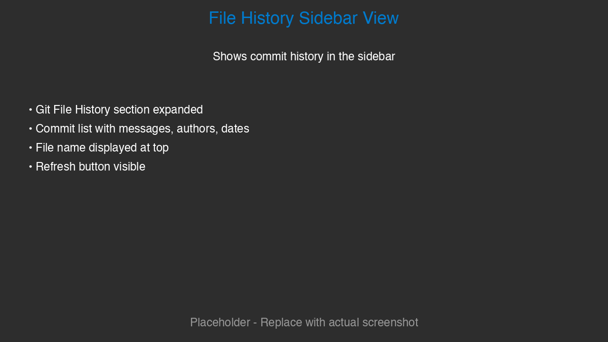
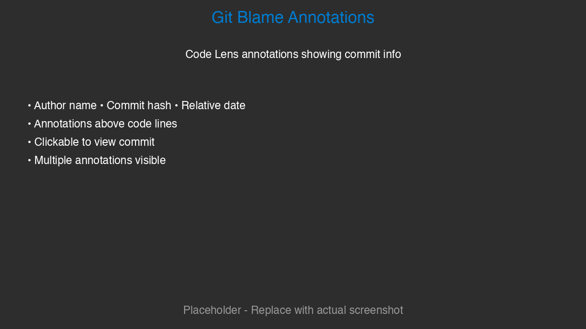
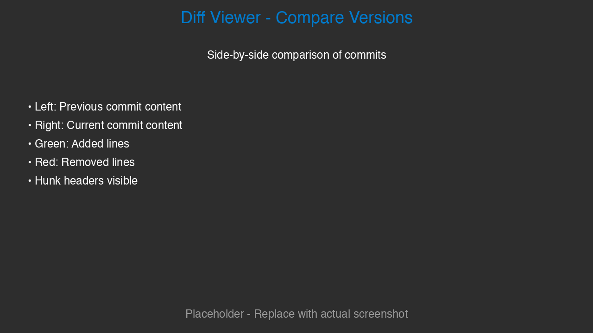
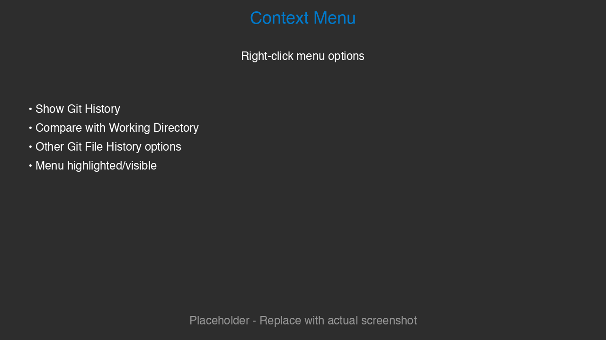
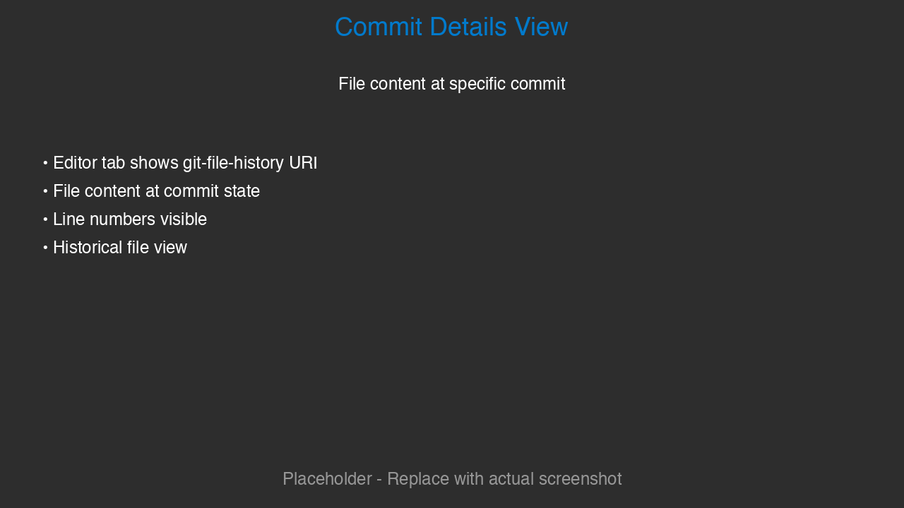
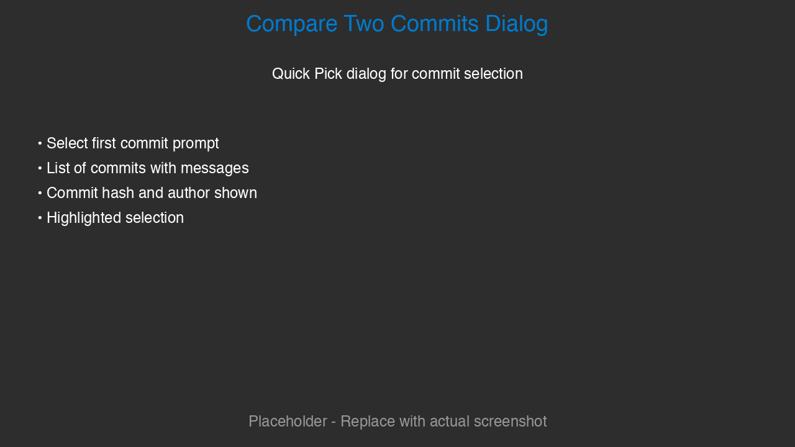

<div align="center">

# Minimal Git file history

A VSCode/Cursor extension that provides comprehensive Git file history navigation similar to JetBrains IDEs. View commit history, compare versions, see Git Blame annotations, and navigate through commits effortlessly.

</div>

## Screenshots

> **Note:** The screenshots below are placeholders. To capture actual screenshots of the extension, follow the instructions in `SCREENSHOT_INSTRUCTIONS.md` or run `python3 generate_screenshots.py` to create placeholder images.

### 📸 File History Sidebar View



The Git File History sidebar view showing commit history for a selected file. Each commit displays the commit message, author, and relative date.

### 📸 Git Blame Annotations



Git Blame annotations showing who last modified each line of code. Click on any annotation to jump to that commit.

### 📸 Diff Viewer - Compare Versions



Side-by-side diff view comparing two commits. Added lines are highlighted in green, removed lines in red.

### 📸 Context Menu



Context menu options available from the Explorer. Right-click any file to access Git File History features.

### 📸 Commit Details View



Viewing a file at a specific commit. The file content reflects the state at that point in time.

### 📸 Compare Two Commits Dialog



Quick Pick dialog for selecting commits to compare. Choose any two commits from the history.

## Features

### 📜 File History View
- **Sidebar Tree View**: Browse commit history for any file in a dedicated sidebar view
- **Commit Details**: See commit hash, author, date, and message for each commit
- **Quick Navigation**: Click on any commit to view the file at that point in time

### 🔍 Diff Viewer
- **Compare with Previous**: Compare any commit with its parent
- **Compare with Working Directory**: See changes between a commit and your current working directory
- **Compare Two Commits**: Select any two commits to see differences
- **Visual Diff**: Opens in VSCode's built-in diff viewer with side-by-side comparison

### 👤 Git Blame Annotations
- **Inline Annotations**: See who last modified each line of code
- **Code Lens Integration**: Click on annotations to jump to the commit
- **Toggle On/Off**: Enable or disable blame annotations with a single command

### 🧭 Commit Navigation
- **Parent/Child Navigation**: Navigate through commit relationships
- **File History**: Track how a file evolved over time
- **Commit Filtering**: Filter commits by date, author, or message

## Usage

### View File History

1. **From Explorer**: Right-click on any file → `Show Minimal Git file history`
2. **From Editor**: Right-click in the editor → `Show Minimal Git file history`
3. **Command Palette**: Press `Ctrl+Shift+P` (or `Cmd+Shift+P` on Mac) → `Minimal Git file history: Show Minimal Git file history`

The history will appear in the "Minimal Git file history" sidebar view.

### Compare Versions

1. **Compare with Previous Commit**:
   - Right-click on a file → `Compare with Previous Commit`
   - Or select a commit in the history view and use the context menu

2. **Compare with Working Directory**:
   - Right-click on a file → `Compare with Working Directory`
   - See what changed since the last commit

3. **Compare Two Commits**:
   - Right-click on a file → `Compare Two Commits`
   - Select the two commits from the quick pick menu

### Git Blame

1. **Toggle Blame**:
   - Right-click in the editor → `Toggle Git Blame`
   - Or use Command Palette → `Minimal Git file history: Toggle Git Blame`

2. **View Commit from Blame**:
   - Click on any blame annotation (Code Lens) to jump to that commit

### View File at Specific Commit

- Click on any commit in the history view
- Or use Command Palette → `Minimal Git file history: View File at Commit`

## Configuration

Open Settings (`Ctrl+,` or `Cmd+,`) and search for `Minimal Git file history`:

### Available Settings

- **`minimalGitHistory.maxCommits`** (number, default: `100`)
  - Maximum number of commits to fetch when viewing file history
  - Higher values may slow down loading for files with extensive history
  - Range: positive integer

- **`minimalGitHistory.blameEnabled`** (boolean, default: `true`)
  - Enable Git Blame annotations by default
  - When enabled, CodeLens annotations show commit information above each line
  - Can be toggled on/off via the command palette or context menu

- **`minimalGitHistory.dateFormat`** (string, default: `"relative"`)
  - Date format for commit display in the history view
  - Options:
    - `"relative"`: Shows relative time (e.g., "2 hours ago", "3 days ago")
    - `"absolute"`: Shows absolute date and time (e.g., "2024-01-15 14:30:00")
    - `"both"`: Shows both relative and absolute (e.g., "2 hours ago (2024-01-15 14:30:00)")

- **`minimalGitHistory.autoLoadOnFileSelect`** (boolean, default: `false`)
  - Automatically load Git history in the Minimal Git file history panel when a file is selected or opened in the editor
  - When enabled, the history panel updates automatically as you switch between files
  - Recommended for users who frequently review file history

### Example Configuration

You can configure these settings in your `settings.json`:

```json
{
  "minimalGitHistory.maxCommits": 200,
  "minimalGitHistory.blameEnabled": true,
  "minimalGitHistory.dateFormat": "both",
  "minimalGitHistory.autoLoadOnFileSelect": true
}
```

## Commands

All commands are available via Command Palette (`Ctrl+Shift+P` / `Cmd+Shift+P`):

- `Minimal Git file history: Show Minimal Git file history` - Show commit history for current file
- `Minimal Git file history: Toggle Git Blame` - Enable/disable Git Blame annotations
- `Minimal Git file history: Compare with Previous Commit` - Compare file with previous commit
- `Minimal Git file history: Compare with Working Directory` - Compare file with working directory
- `Minimal Git file history: Compare Two Commits` - Compare two selected commits
- `Minimal Git file history: View File at Commit` - View file at specific commit
- `Minimal Git file history: Refresh` - Refresh the history view

## Requirements

- VSCode 1.80.0 or higher
- Git installed and available in PATH
- A Git repository (initialized with `git init` or cloned)

## Installation

1. Open VSCode/Cursor
2. Go to Extensions view (`Ctrl+Shift+X` / `Cmd+Shift+X`)
3. Search for "Minimal Git file history"
4. Click Install
5. Reload the window if prompted

## How It Works

The extension uses Git commands to:
- Fetch commit history with `git log`
- Get file contents at specific commits with `git show`
- Generate diffs with `git diff`
- Show blame information with `git blame`

All Git operations are performed in the background, and results are cached for performance.

## Keyboard Shortcuts

You can customize keyboard shortcuts in Keybindings (`Ctrl+K Ctrl+S` / `Cmd+K Cmd+S`):

- Search for `minimalGitHistory` or `gitFileHistory` to see all available commands
- Assign your preferred shortcuts

## Troubleshooting

### No commits found
- Make sure you're in a Git repository
- Check that the file has been committed at least once
- Verify Git is installed: run `git --version` in terminal

### Git commands failing
- Ensure Git is in your system PATH
- Check repository permissions
- Try running `git status` in terminal to verify repository state

### Blame not showing
- Make sure `minimalGitHistory.blameEnabled` is set to `true` in settings
- The file must be tracked by Git
- Try refreshing the editor or toggling blame off and on again

## Contributing

Contributions are welcome! Please feel free to submit a Pull Request.

## License

MIT License

## Author

**WaYdotNET (Carlo Bertini)**

## Acknowledgments

Inspired by JetBrains IDE's Local History and Git History features.
